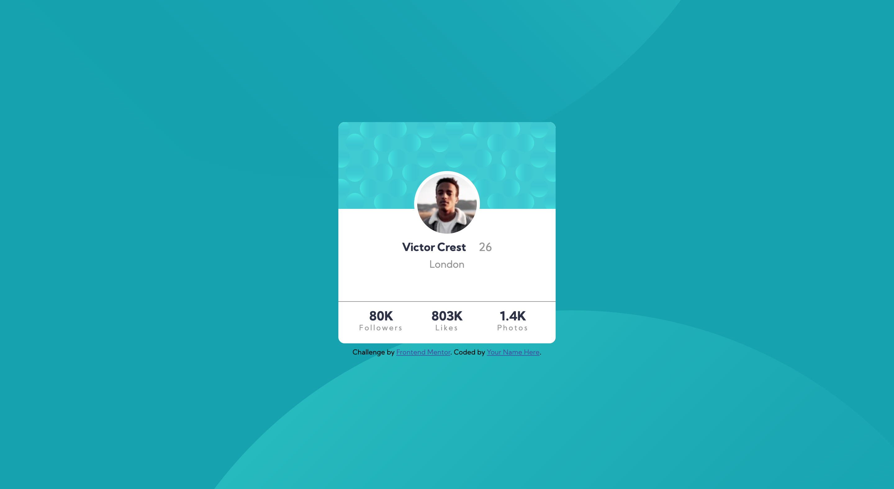

# Frontend Mentor - Profile card component solution

This is a solution to the [Profile card component challenge on Frontend Mentor](https://www.frontendmentor.io/challenges/profile-card-component-cfArpWshJ). Frontend Mentor challenges help you improve your coding skills by building realistic projects.

## Table of contents

- [Frontend Mentor - Profile card component solution](#frontend-mentor---profile-card-component-solution)
  - [Table of contents](#table-of-contents)
  - [Overview](#overview)
    - [The challenge](#the-challenge)
    - [Screenshot](#screenshot)
    - [Links](#links)
  - [My process](#my-process)
    - [Built with](#built-with)
    - [What I learned](#what-i-learned)
    - [Continued development](#continued-development)
  - [Author](#author)

**Note: Delete this note and update the table of contents based on what sections you keep.**

## Overview

### The challenge

- Build out the project to the designs provided

### Screenshot

### Links

- Solution URL: [https://github.com/C-likethis123/profile-card-component-main](https://github.com/C-likethis123/profile-card-component-main)
- Live Site URL: [https://c-likethis123.github.io/profile-card-component-main/](https://c-likethis123.github.io/profile-card-component-main/)

## My process

### Built with

- HTML
- SASS
- Mobile-first workflow

I first started out with a mobile-first framework and used an [SCSS version of Eric's Meyer's CSS reset](https://github.com/ianrose/reset-scss).
According to the mobile design, I sketched out on paper the 'boxes' I could identify in the image.
After identifying the boxes, I could code out the HTML structure and add the CSS rules accordingly.

### What I learned

Code organisation:

- After looking through some sample solutions, I decided to better structure my code.
- It is divided into 2 components:
  - CSS reset stylesheet
  - Base CSS

Centering items:

- `margin: 0 auto` tells the browser to determine the left and right margins by itself, which it does by setting them equally.

SASS:

- I learnt how to compile CSS files from SCSS. There is a convenient command `sass --watch scss:css` which I used to watch for scss files in the `/scss` folder. When there are changes in that folder, it will compile the files into CSS files and place them in the `/css` folder.
- I learnt about variables and nesting, and tried to apply it to my project.

### Continued development

In the future, I would like to focus on backgrounds and images. I realise I am not very good at coding out backgrounds and images, and I need to refer to help very often.

It would also be good to improve my understanding of SASS and use it in more projects.

## Author

- Website - [Chow Jia Ying](http://c-likethis123.github.io/website)
- Frontend Mentor - [@C-likethis123](https://www.frontendmentor.io/profile/C-likethis123)
